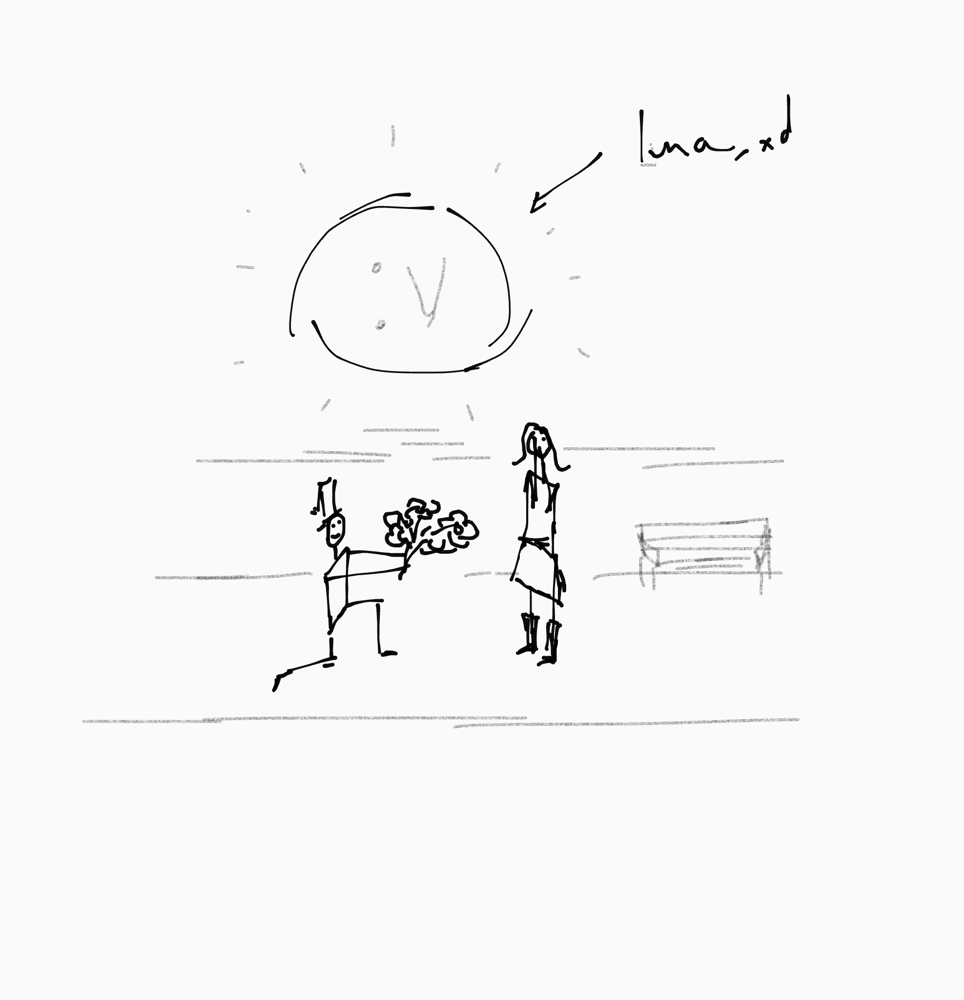

+++
title = "Aprender a Dibujar"
date = 2025-12-12T10:30:00
author = "Joan Ferley Mosquera Lozano"
+++

Siempre he querido aprender a dibujar, pero cada vez que empiezo, dejo todo a medio camino :v (como todo). Hace uno días conocí a alguien que dibuja y me hizo recordar lo tranquilo que puede ser sentarse por un tiempo a hacer mamarachos :u

Estoy en el jale, y como no puedo entrar ninguna monda, toda dibujar a mouse.

Estos son algunas de las cosas que he hecho para empezar a practicar. 

Este esta fino fino jijija  

.png)

:v Voy a seguir practicando y en la sección de learn podrán ver las cosas que voy a ir haciendo. Chamacos perros. 