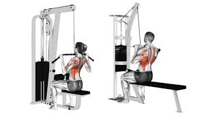
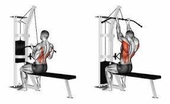
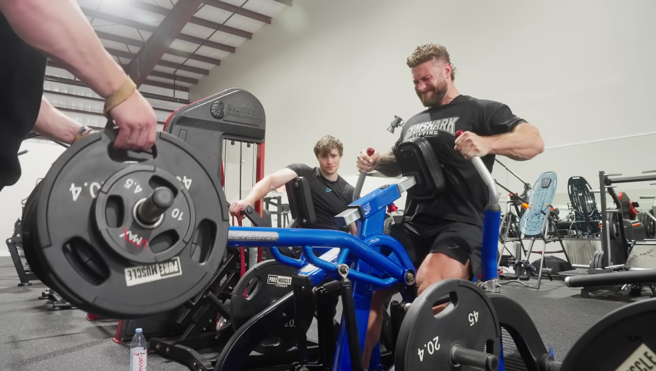
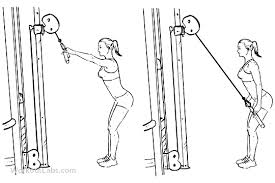
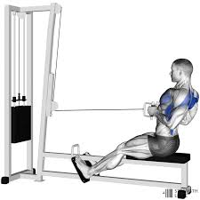
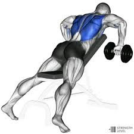

+++
title = "Rutina de Espalda"
date = 2025-12-18T10:30:00
author = "Joan Ferley Mosquera Lozano"
description = "Rutina de espalda robada de Chris Bumstead"
cover = "muscle-man.jpeg"
+++

Esta rutina me la robe de un video de **Chris Bumstead** :v La verdad se ve bastante prometedora, entonces estoy haciendo este post para cuando este en el gym, hacerla pa ve que lo que.

## Lat Pulldown

Bueno, la rutina empieza con **Lat Pulldown** (Jalón al pecho) de la siguiente forma:

1. Wide grip, four seconds negative 8 reps. Cuando menciona negatives, significa que, cuando se lleve el peso al pecho, al subir, por lo menos durar 4 segundos. 
    

2. Medium grip, AMRAP (As Many Repetitions As Possible), es decir, al fallo :v
    

3. Underhand grip, AMRAP
    

## Isolateral row

Ahora sigue el Isolateral row. Los carevergas no dicen cuántas repeticiones y series hacer, entonces vamos a hacer tres series de 8 a 12 repeticiones. Imagen de referencia:

## Tri-set final: (3) + (4) + (5)

Ahora vamos a hacer un tri-set. Tri-set = se hacen 3 ejercicios seguidos como una sola “mega-serie”.

**Orden**

1. Straight-arm rope pulldown
    
2. Seated row
    
3. Chest-supported DB row
    

**Descanso**

* Entre ejercicio casi nada, solo lo que tome cambiar de estación.
* Al terminar los tres, descansar entre minuto y medio a 3 y vuelve y se repite el tri-set.

Familia, eso es todo :v me robe ese poco de imágenes de Google adfjhlajkdshfka sorrys